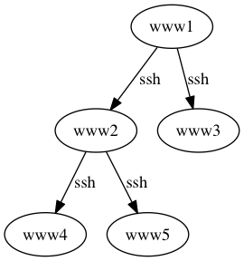

# brigade

brigade is a file transfer tool via ssh bucket brigade.

This software is alpha quality.

## Install

```
go get -u github.com/fujiwara/brigade/cmd/brigade
```

## Usage

brigade requires a transfer node definition by text format. e.g.

```
# transfer.txt
www1 -> www2
www1 -> www3
www2 -> www4
www2 -> www5
--
```



brigade accepts concatenated the definition and a file content which concatinated on STDIN.

```
[www1]$ cat transfer.txt /path/to/srcfile | brigade /path/to/dstfile
```

1. on www1 brigade works
   - copy srcfile into dstfile.
   - execute
     - `ssh www2 bridage /path/to/dstfile`
     - `ssh www3 bridage /path/to/dstfile`
1. on www2 brigade works
   - copy srcfile into dstfile.
   - execute
     - `ssh www4 bridage /path/to/dstfile`
     - `ssh www5 bridage /path/to/dstfile`
1. on www3, www4, www5 brigade works
   - copy srcfile into dstfile.

### Limitations (currently)

- A `brigade` binary must be placed on the same path in all hosts.
- for ssh
  - user is used from `USER` environment variable.
  - A identity file is fixed on `$HOME/.ssh/id_rsa`
- hostnames in the transfer difinition must be equal to Golang's `os.Hostname()` (hostname(1) results).

## LICENSE

The MIT License (MIT)

Copyright (c) 2017 FUJIWARA Shunichiro / KAYAC Inc.
